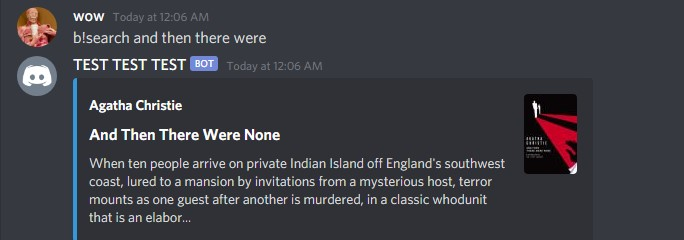

# BookClubBot

## Description
The primary task of this bot is to allow voting for the book to read much easier.
It uses a ranked system voting, where each person can nominate book and then vote their most preferred book, followed by their second, third, and so on.
As a side feature, this book also allows you to search for books using `b!search`. Behind the scenes, this uses Google Books.

## How to
Currently, the prefix is set to `b!`. As of now that can't be changed, but expect an update soon.

Here are some essential commands: \

Commands that don't require anything: \
`search [query]`: Just like using google books. Enter the query, and receive the description of the first book that's returned by Google. \
`list`: List all the nominated books during a voting session. \

Commands that require the "trusted" role: \
`start`: Starts a voting session. Allows you to nominate books and vote. \
`end`: Ends the voting session. Also declares the winner. \
`(v)ote [id1] [id2] [id3]...`: Vote for the selected books. the `id` can be retrieved from `list` \
`(nom)inate`: Nominate a book during a voing session. This allows users to vote on it. \

## Screenshots

